# week_3_Navigation and State management

## Screenshots

### Navigation

<table>
  <tr>
    <td align="center">
      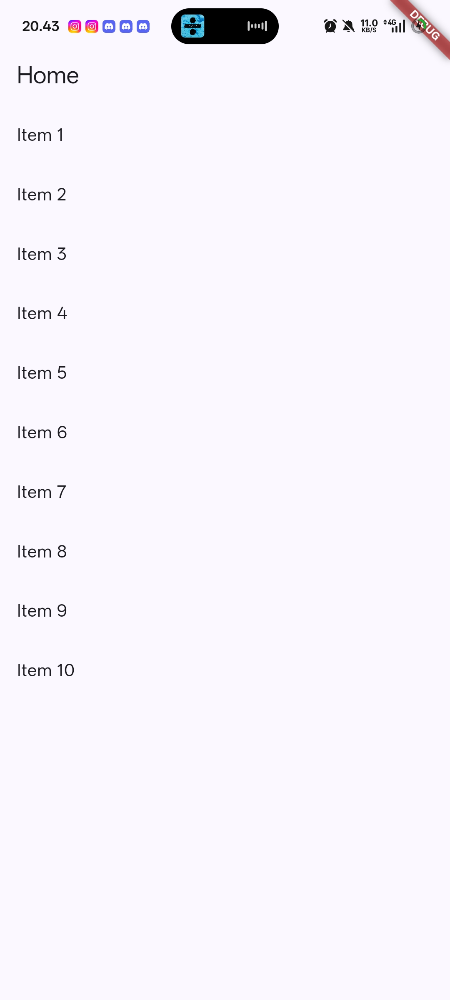 
      <b>Navigation 1</b>
    </td>
    <td align="center">
      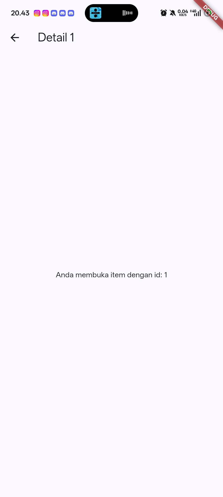 
      <b>Navigation 2</b>
    </td>
  </tr>
</table>

### To-Do

<table>
  <tr>
    <td align="center">
      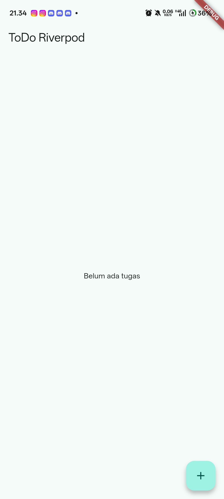 
      <b>To-Do 1</b>
    </td>
    <td align="center">
      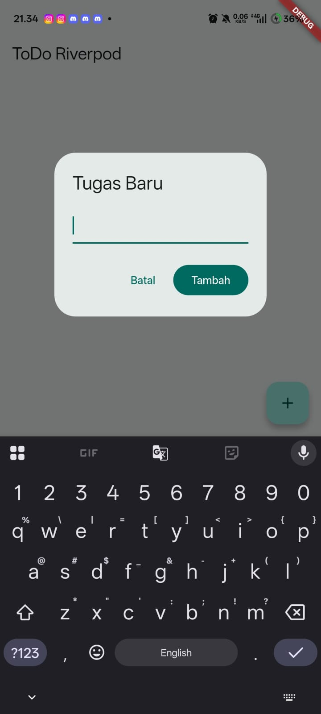 
      <b>To-Do 2</b>
    </td>
    <td align="center">
      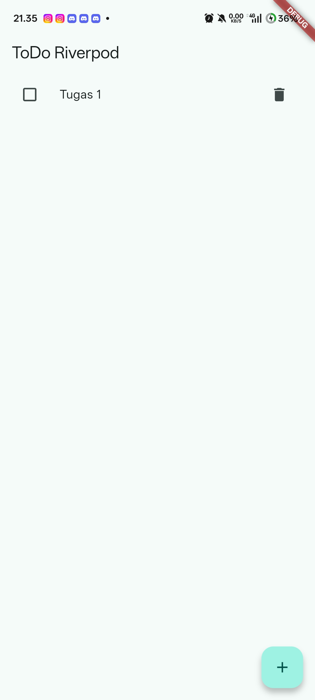 
      <b>To-Do 3</b>
    </td>
    <td align="center">
      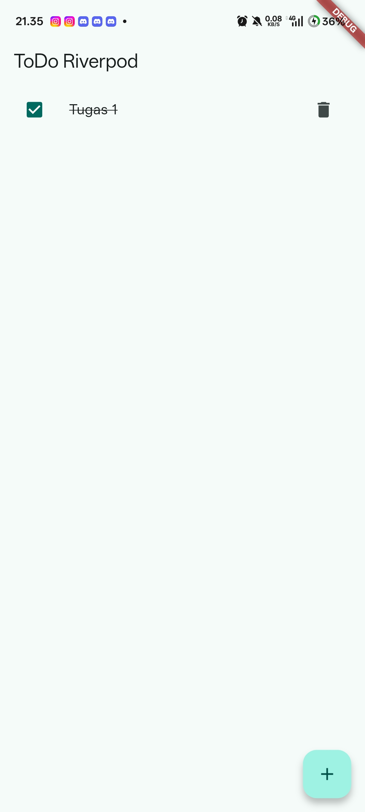 
      <b>To-Do 4</b>
    </td>
  </tr>
</table>

## Uji ketiga state
<table>
  <tr>
    <td align="center">
      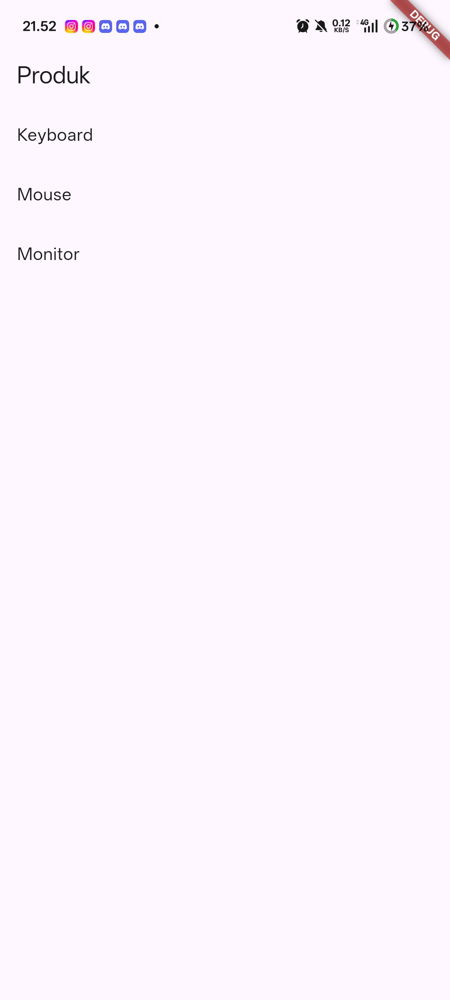 
      <b>Home</b>
    </td>
    <td align="center">
      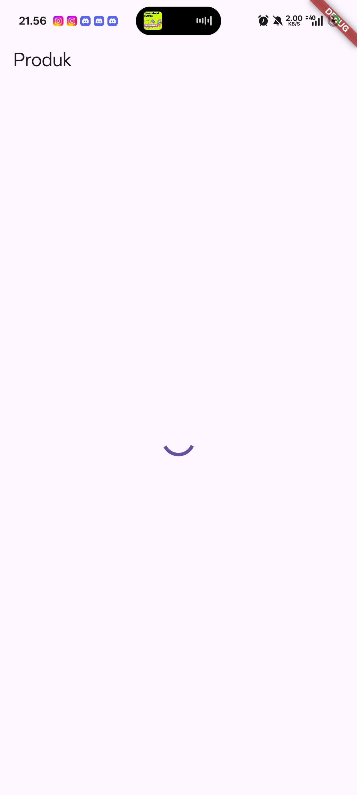 
      <b>Loading</b>
    </td>
    <td align="center">
      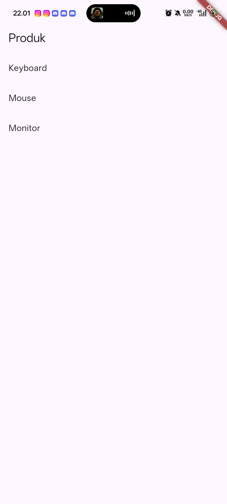 
      <b>Success</b>
    </td>
    <td align="center">
      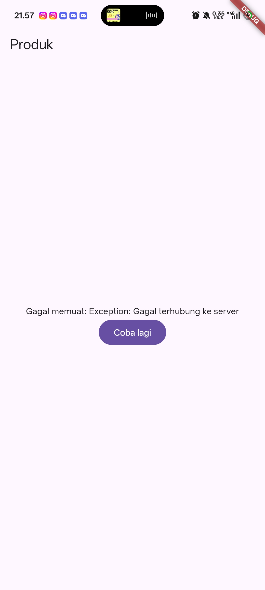 
      <b>Error</b>
    </td>
  </tr>
</table>

Menampilkan data lama dengan indikator refresh lebih baik karena pengguna masih memiliki informasi yang bisa dilihat sambil menunggu data terbaru. Pengguna juga mendapat kepastian bahwa aplikasi sedang memproses pembaruan, bukan mengalami error. Pola ini penting ketika proses pengambilan data membutuhkan waktu dan data sebelumnya masih relevan untuk sementara. Daripada layar dikosongkan dan membuat pengguna bertanya-tanya.

## Refactoring dan Testing
Saya mengganti pump() menjadi pumpAndSettle() setelah menekan tombol Tambah karena dialog masih dalam proses ditutup. pumpAndSettle() memastikan seluruh perubahan UI selesai sebelum pengecekan dijalankan, sehingga test tidak salah mendeteksi teks pada TextField sebagai Todo.
PS E:\College\Code File\Jasmine-Nasywa-mobile-course\week_3_todo> flutter test
00:05 +1: All tests passed!   
                                                                                            
PS E:\College\Code File\Jasmine-Nasywa-mobile-course\week_3_todo> flutter analyze
Analyzing week_3_todo...                                                
No issues found! (ran in 13.2s)

<td align="center">
      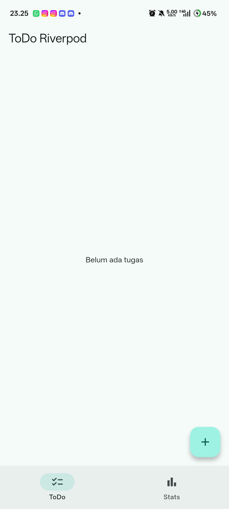 
      <b>Menggunakan GoRouter</b>
    </td>

## Refleksi
1. setState cukup untuk state lokal/sederhana yang hanya dipakai satu widget; naik ke Riverpod kalau state perlu dipakai banyak widget/halaman atau dikelola terpusat.
2. context.go berpindah ke route dan mengganti lokasi saat ini, sedangkan context.push menambahkan route ke stack sehingga bisa kembali dengan Back.
3. AsyncValue menyatukan state menjadi loading, data, atau error, sehingga mencegah kombinasi boolean yang saling bertentangan seperti isLoading = true sekaligus hasError = true.
4. seharusnya memperbaiki komentar supaya analyzer tidak melihatnya sebagai html.

## Ai Prompt Challenge

1. State tidak dimutasi secara langsung. Data dikembalikan sebagai list baru dan tidak ditemukan penggunaan state.add(). Ai menuliskannya sebagai 
return [
  'Total Pengguna: 1.250',
  'Pengguna Aktif: 875',
  'Pendapatan: Rp12.500.000',
];

2. ref.watch final statsAsync = ref.watch(statsProvider); Dipakai di Widget build(...). Kemudian ref.invalidate(statsProvider); ada di callback.

3. Di kode ai :

statsAsync.when(

ada:

loading: () => ...
error: (error, stackTrace) => ...
data: (stats) => ...

4. pada kode
  AsyncNotifierProvider<
  StatsNotifier,
  List<String>
>

dikatakan jelas bahwa provider ini menggunakan StatsNotifier dan menghasilkan List<String>
tipe explisit dan hanya satu

5. class StatsNotifier extends AsyncNotifier<List<String>>
kode ini menggunakan API riverpod baru

6. Analyze :
Analyzing week_3...                                                     

   info - Angle brackets will be interpreted as HTML. Try using backticks
          around the content with angle brackets, or try replacing `<` with
          `&lt;` and `>` with `&gt;` - lib\pages\stats_page.dart:13:52 -
          unintended_html_in_doc_comment

1 issue found. (ran in 35.4s)

Terdapat 1 info unintended_html_in_doc_comment karena penggunaan tanda < > pada komentar dokumentasi dianggap sebagai HTML oleh analyzer. Tidak berkaitan dengan logika program.

Test :
00:04 +1: All tests passed! 

## Getting Started

This project is a starting point for a Flutter application.

A few resources to get you started if this is your first Flutter project:

- [Learn Flutter](https://docs.flutter.dev/get-started/learn-flutter)
- [Write your first Flutter app](https://docs.flutter.dev/get-started/codelab)
- [Flutter learning resources](https://docs.flutter.dev/reference/learning-resources)

For help getting started with Flutter development, view the
[online documentation](https://docs.flutter.dev/), which offers tutorials,
samples, guidance on mobile development, and a full API reference.
