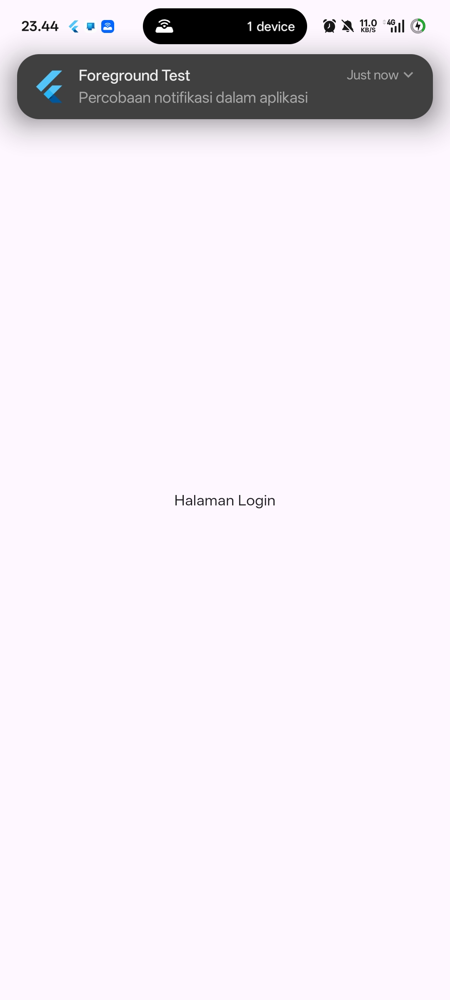
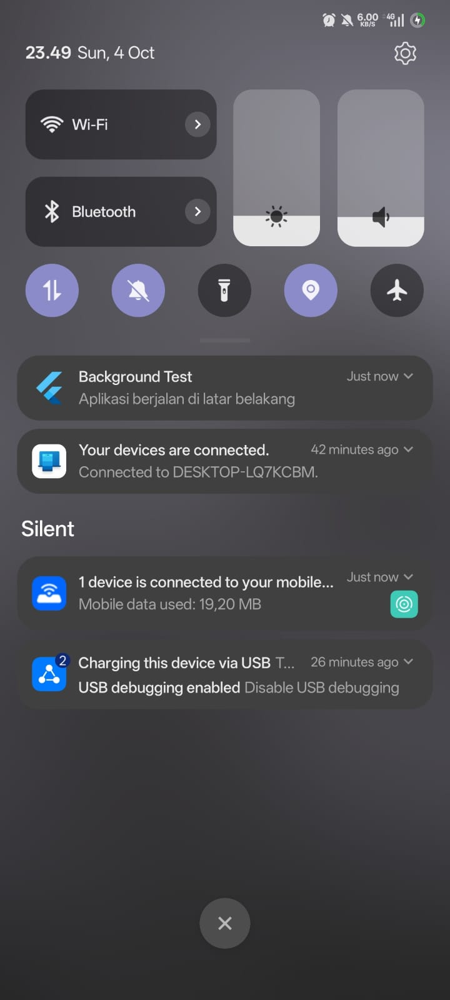
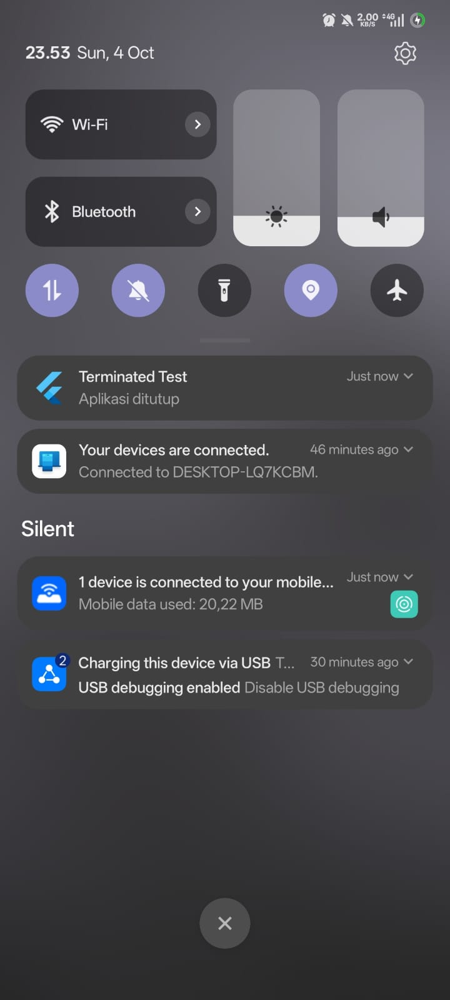
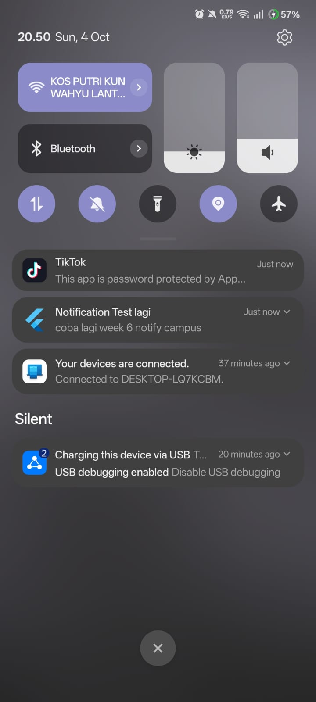

# week_6_campus_notify

## Screenshots
<h3>Screenshot Pengujian</h3>
<table>
  <tr>
    <th>Test</th>
    <th>Screenshot</th>
    <th>Result</th>
  </tr>
  <tr>
    <td>Foreground</td>
    <td></td>
    <td>Notifikasi berhasil diterima dan ditampilkan saat aplikasi aktif di foreground.</td>
  </tr>
  <tr>
    <td>Background</td>
    <td></td>
    <td>Notifikasi diterima saat aplikasi berjalan di background.</td>
  </tr>
  <tr>
    <td>Terminated</td>
    <td></td>
    <td>Aplikasi berhasil dibuka dari status terminated melalui event getInitialMessage.</td>
  </tr>
  <tr>
    <td>Praktikum 2A</td>
    <td></td>
    <td>Pengujian bagian pertama praktikum FCM berhasil dijalankan.</td>
  </tr>
  <tr>
    <td>Praktikum 2B Sebelum Ditekan</td>
    <td></td>
    <td>Tampilan notifikasi lokal sebelum banner notifikasi ditekan.</td>
  </tr>
  <tr>
    <td>Setelah Ditekan (Umum)</td>
    <td></td>
    <td>Navigasi rute sukses setelah banner notifikasi diklik pengguna.</td>
  </tr>
  <tr>
    <td>Praktikum 2B Setelah Ditekan</td>
    <td></td>
    <td>Aplikasi berhasil mengarahkan ke halaman detail rute spesifik pasca klik.</td>
  </tr>
</table>

## Refactoring dan testing
1. Keamanan Penyimpanan Token. Token autentikasi dan FCM disimpan secara aman menggunakan flutter_secure_storage untuk mencegah kebocoran data sensitif. 

2. Penanganan Kesalahan API (HTTP 401 & Token Refresh). Sistem dilengkapi dengan mekanisme interceptor yang mendeteksi respons kode status 401 (Unauthorized). Kegagalan pada proses refresh token secara otomatis akan menghapus sesi user dan mengarahkan kembali ke halaman login.   

3. Pengujian Status Aplikasi (App State) dan Pengujian Unit. Seluruh status aplikasi (Foreground, Background, dan Terminated) telah berhasil diuji dan didokumentasikan dalam tabel bukti pengujian. Mekanisme deep linking berfungsi dengan baik, di mana notifikasi berhasil mengarahkan pengguna menuju rute tujuan yang tepat.

4. Strategi Pengiriman Pesan. Penggunaan topik (topics) diterapkan untuk penyiaran informasi massal (broadcast), sedangkan token perangkat unik digunakan untuk pengiriman pesan bersifat personal

- flutter analyze -> memiliki beberapa dead code 
PS E:\College\Code File\Jasmine-Nasywa-mobile-course\week_6_campus_notify> flutter analyze
Analyzing week_6_campus_notify...                                       

   info - Don't invoke 'print' in production code. Try using a logging framework - lib\fcm_service.dart:9:3 - avoid_print
warning - Dead code. Try removing the code, or fixing the code before it so that it can be reached - lib\main.dart:109:18
       - dead_code
warning - Dead code. Try removing the code, or fixing the code before it so that it can be reached - lib\main.dart:109:33
       - dead_code
   info - Unnecessary use of multiple underscores. Try using '_' - lib\main.dart:113:49 - unnecessary_underscores
   info - Unnecessary use of multiple underscores. Try using '_' - lib\main.dart:114:48 - unnecessary_underscores
   info - Don't invoke 'print' in production code. Try using a logging framework - lib\messaging\push_service.dart:53:5 -
          avoid_print
warning - Unused import: 'package:dio/dio.dart'. Try removing the import directive - lib\providers\auth_provider.dart:1:8
       - unused_import
warning - Unused import: 'package:flutter_riverpod/flutter_riverpod.dart'. Try removing the import directive -
       test\widget_test.dart:2:8 - unused_import

8 issues found. (ran in 5.7s)
PS E:\College\Code File\Jasmine-Nasywa-mobile-course\week_6_campus_notify> 

- flutter test
PS E:\College\Code File\Jasmine-Nasywa-mobile-course\week_6_campus_notify> flutter test
00:15 +4: All tests passed!      

## Refleksi
1. Token tidak boleh disimpan di SharedPreferences karena disimpan dalam bentuk plaintext tanpa enkripsi, sehingga rentan dibaca oleh aplikasi pihak ketiga atau perangkat yang di-root; risikonya penyerang dapat terus menghasilkan token akses baru untuk menyamar sebagai pengguna secara permanen.

2. Jika onTokenRefresh diabaikan, aplikasi tidak akan memperbarui token pendaftaran FCM saat kedaluwarsa atau saat instalasi ulang, yang mengakibatkan perangkat gagal menerima pengiriman notifikasi penting kampus secara terus-menerus selama satu semester.

3. Topik digunakan untuk broadcast seperti pengumuman libur nasional bagi seluruh mahasiswa, sedangkan token perangkat dipakai untuk pesan personal seperti pemberitahuan status pembayaran UKT mahasiswa tertentu.

4. Saya menolak beberapa code dimana beberapa fungsi masih undefined serta beberapa target url yang tidak ditemukan sehingga masih harus diperbaiki.
## AI Challenge
- Background handler top-level: ya. firebaseMessagingBackgroundHandler adalah fungsi top-level di push_background.dart dengan @pragma('vm:entry-point'), bukan method kelas.
- onTokenRefresh: ya, token benar-benar dikirim lewat DeviceApi.registerDevice (POST /devices) dengan header Authorization dari secure storage. Token tidak hanya dicetak ke log.
- Foreground: ya, memakai local notification manual lewat onMessage. Di iOS saya matikan banner sistem saat foreground (alert: false) supaya tidak muncul dobel.
- Klik dari tiga state: semuanya masuk lewat _navigate(data.route).
Foreground: payload local notification.
Background: onMessageOpenedApp.
Terminated: getInitialMessage, plus getNotificationAppLaunchDetails untuk klik local notification.
- Rute divalidasi (hanya / dan /announcement/*). Buktinya harus lewat docs/TEST_TABLE.md di perangkat nyata.
- Token/secret: tidak ada yang di-hardcode. Base URL lewat --dart-define, token auth di secure storage, dan log memakai maskSecret yang hanya menampilkan 4 karakter awal dan akhir.
- Keputusan teknis: semua penanda ada di komentar kode.
Tanpa BuildContext: PushService, LocalNotifier, DeviceApi, SecureStore, dan background handler. Navigasi memakai GoRouter yang di-inject lewat Riverpod, jadi service tetap bisa dites tanpa widget.
Berbeda Android 13+ dan iOS: komentar [ANDROID 13+] dan [iOS].
Android 13+: izin runtime POST_NOTIFICATIONS (plus deklarasi di manifest) dan pembuatan channel.
iOS: requestPermission dan menunggu APNs token sebelum getToken.
Pesan data-only: pesan yang membawa payload notification ditampilkan OS sendiri, jadi background handler hanya membuat notifikasi manual untuk pesan data-only, supaya tidak dobel.

Analyzing campus_notification_app...                                    

  error - Target of URI doesn't exist: 'firebase_options.dart'. Try creating the file referenced by the URI, or try using
         a URI for a file that does exist - lib\main.dart:6:8 - uri_does_not_exist
  error - Undefined name 'DefaultFirebaseOptions'. Try correcting the name to one that is defined, or defining the name -
         lib\main.dart:11:41 - undefined_identifier
  error - Target of URI doesn't exist: '../firebase_options.dart'. Try creating the file referenced by the URI, or try
         using a URI for a file that does exist - lib\services\push_background.dart:3:8 - uri_does_not_exist
  error - Undefined name 'DefaultFirebaseOptions'. Try correcting the name to one that is defined, or defining the name -
         lib\services\push_background.dart:14:41 - undefined_identifier

4 issues found. (ran in 2.6s)

## Getting Started

This project is a starting point for a Flutter application.

A few resources to get you started if this is your first Flutter project:

- [Learn Flutter](https://docs.flutter.dev/get-started/learn-flutter)
- [Write your first Flutter app](https://docs.flutter.dev/get-started/codelab)
- [Flutter learning resources](https://docs.flutter.dev/reference/learning-resources)

For help getting started with Flutter development, view the
[online documentation](https://docs.flutter.dev/), which offers tutorials,
samples, guidance on mobile development, and a full API reference.
